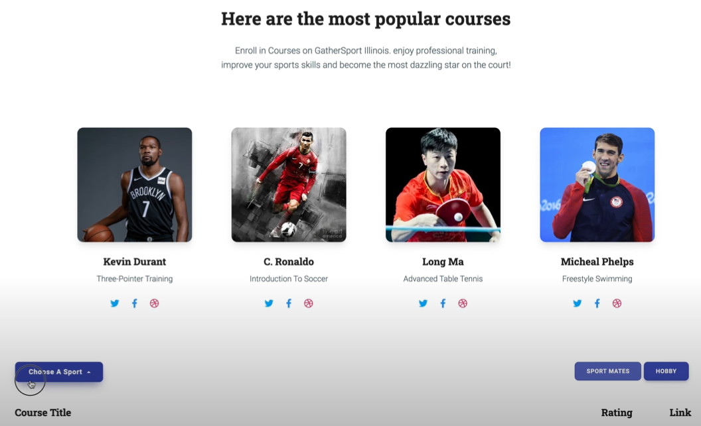

# GatherSports
## Video Demo:
https://www.youtube.com/watch?v=Xby9c__khGg&feature=youtu.be&ab_channel=YunchunPan
## Introduction

GATHERSPORTS is an application developed for CS 411 Database System taken for my Master of Computer Science degree at UIUC. This platform is a sports experience system that connects sports mates with similar sports interests, so that people have more incentives to exercise.

## Functionalities
- register and login to the system
- update own profile information individually
- match and connect to sport mates with similar hobbies
- make and delete court reservations to play sports
- make and delete coach appointments to get in-person practices
- enroll in interested courses
- send out messages in the system
## Tools & Programming languages
- Database: MySQL
- Backend: SprintBoot, MyBatis
- Frontend: React.js
- Supported Cloud: Google Cloud Platform, Firebase
